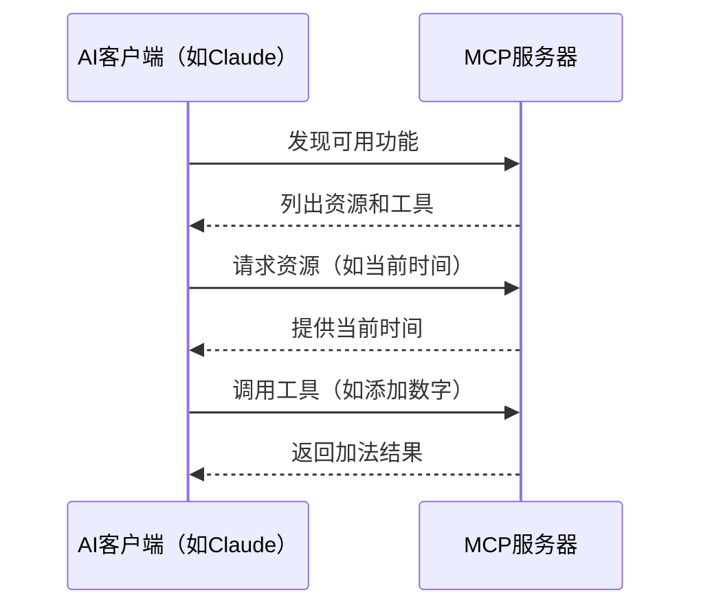

# 第一部分：MCP协议基础与实践
## 第2期 MCP与主流工具的集成：Claude和Cursor使用指南

## 1.2 MCP与主流工具的集成：Claude和Cursor使用指南

在了解了MCP的基础概念后，本节将详细介绍如何在Claude和Cursor这两个主流工具中集成和使用MCP，让您的AI助手能够访问更多外部资源和功能。

### 在Claude中使用MCP

MCP与Claude的集成主要通过Claude Desktop应用程序实现。以下是使用步骤：

1. **确保安装最新版本**：下载并安装最新的Claude Desktop，可从[Claude Desktop Downloads](https://www.anthropic.com/claude-desktop)获取。

2. **启用开发者模式**：从菜单打开设置，导航到开发者选项并启用。

3. **配置MCP服务器**：编辑claude_desktop_config.json文件（在macOS上位于~/Library/Application Support/Claude/claude_desktop_config.json）以添加MCP服务器。例如，要添加文件系统服务器：

   ```json
   {
     "mcpServers": {
       "filesystem": {
         "command": "npx",
         "args": ["@modelcontextprotocol/server-filesystem"]
       }
     }
   }
   ```

4. **重启Claude Desktop**：应用更改后，MCP工具将在输入框中显示为图标（例如锤子图标），允许与服务器功能进行交互。

### 在Cursor中使用MCP

Cursor是Anysphere开发的AI驱动代码编辑器，也支持MCP，实现自定义工具集成。使用方法如下：

1. **打开设置**：在Cursor中导航至"Features" > "MCP"。

2. **添加新服务器**：点击"+ Add New MCP Server"配置服务器，选择传输方式（如stdio）并提供命令或URL。

3. **配置示例**：例如，要添加天气服务器，您可能需要配置命令如`npx /path/to/weather-server`。

在Cursor中，MCP工具可在Composer Agent中使用，用户可以有意提示工具使用。这种集成为自动化软件开发任务提供了巨大潜力。

### MCP工作流程示例

MCP服务器的工作流程通常遵循以下模式：



这个流程图展示了基本流程：AI客户端发现服务器提供的功能，然后根据需要请求资源或调用工具。

### 常见问题与解决方案

- **连接问题**：确保服务器命令正确，且相关依赖已安装。
- **权限问题**：检查Claude或Cursor是否有足够权限执行服务器命令。
- **配置位置**：配置文件的位置可能因操作系统而异，需参考官方文档。

通过本指南，您应该能够在Claude和Cursor中成功集成MCP，为您的AI助手解锁更多强大功能。在后续章节中，我们将学习如何创建自己的MCP服务器，进一步扩展AI的能力范围。