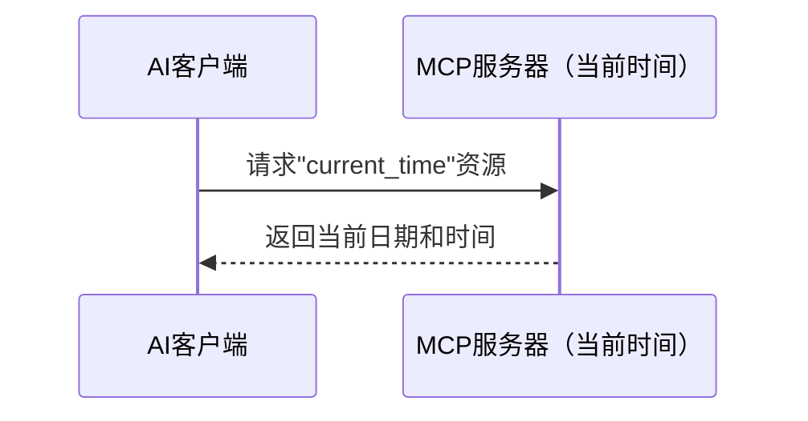
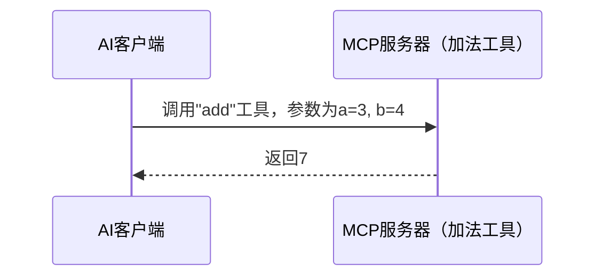
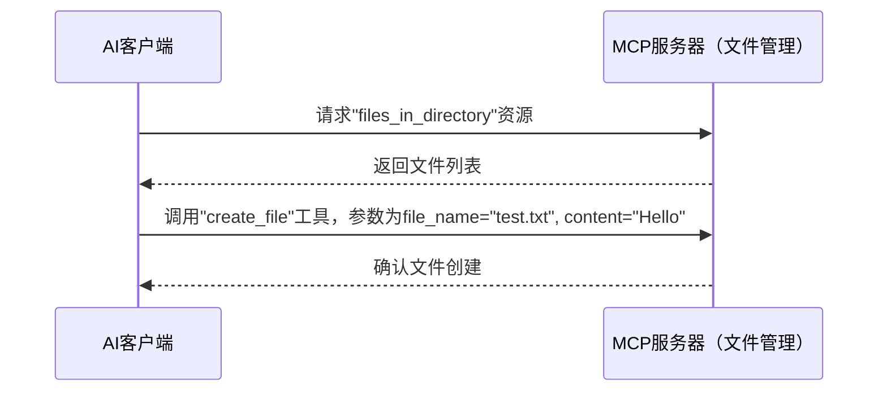

# 第一部分：MCP协议基础与实践
## 第3期 从零开始创建MCP服务器：Python实现指南

## 1.3 从零开始创建MCP服务器：Python实现指南

本节将详细介绍如何使用Python创建自己的MCP服务器，让您能够为AI模型提供自定义功能。通过官方的Python SDK，您可以轻松构建支持资源、提示和工具的服务器。

### 安装MCP Python SDK

首先，您需要安装MCP Python SDK，它提供了构建服务器所需的工具。您可以使用pip进行安装：

```bash
pip install mcp
```

或者，如果您使用`uv`工具（Claude Desktop推荐），请运行：

```bash
uv add "mcp[cli]"
```

在macOS上，可以通过`brew install uv`安装uv工具。

### 创建基本的MCP服务器

要创建服务器，您将使用SDK中的`FastMCP`类。以下是创建步骤：

1. **定义服务器**：创建一个Python脚本，例如`server.py`，导入`FastMCP`并为服务器命名：

   ```python
   from mcp import FastMCP

   mcp = FastMCP("My First Server")
   ```

2. **添加工具**：工具是LLM可以调用的函数，使用`@mcp.tool()`定义。例如，一个加法工具：

   ```python
   @mcp.tool()
   def add(a: int, b: int) -> int:
       """Add two numbers"""
       return a + b
   ```

3. **添加资源**：资源提供数据，使用`@mcp.resource()`定义。例如，一个问候资源：

   ```python
   @mcp.resource("greeting")
   def get_greeting(name: str) -> str:
       return f"Hello, {name}!"
   ```

### 运行和测试服务器

- **开发模式**：使用以下命令运行服务器进行测试：

  ```bash
  mcp dev server.py
  ```

  您可以使用MCP Inspector测试服务器：

  ```bash
  mcp inspector
  ```

- **Claude Desktop集成**：要在Claude Desktop中使用服务器，请安装它：

  ```bash
  mcp install server.py
  ```

  安装后，它将在Claude Desktop中可用，供LLM使用。

### 实例一：当前时间服务器（资源）

这个服务器提供一个返回当前日期和时间的资源。

**代码**：

```python
from mcp import FastMCP
import datetime

mcp = FastMCP("Current Time Server")

@mcp.resource("current_time")
def get_current_time() -> str:
    """Get the current date and time"""
    return datetime.datetime.now().isoformat()

if __name__ == "__main__":
    mcp.run()
```

**工作流程**：



**说明**：
- **功能**：服务器定义了一个名为`"current_time"`的资源。
- **工作原理**：当AI客户端请求此资源时，服务器运行`get_current_time`函数并以ISO格式返回当前日期和时间。
- **用途**：这展示了MCP服务器如何向AI提供数据，如实时信息。

### 实例二：加法服务器（工具）

这个服务器提供一个根据客户端输入将两个数字相加的工具。

**代码**：

```python
from mcp import FastMCP

mcp = FastMCP("Addition Server")

@mcp.tool()
def add(a: int, b: int) -> int:
    """Add two numbers"""
    return a + b

if __name__ == "__main__":
    mcp.run()
```

**工作流程**：



**说明**：
- **功能**：服务器定义了一个名为`"add"`的工具，它接受两个整数(`a`和`b`)并返回它们的和。
- **工作原理**：客户端发送请求使用带参数的`"add"`工具，服务器计算并返回结果。
- **用途**：这演示了MCP服务器如何为AI执行操作，扩展其功能，而不仅仅是提供数据。

### 实例三：文件管理服务器（资源和工具结合）

这个服务器结合了资源（列出文件）和工具（创建文件），展示了多种功能如何协同工作。

**代码**：

```python
from mcp import FastMCP
import os
import tempfile

temp_dir = tempfile.mkdtemp()
print(f"Using temporary directory: {temp_dir}")

mcp = FastMCP("File Management Server")

@mcp.resource("files_in_directory")
def list_files() -> list[str]:
    """List files in the temporary directory"""
    return [file for file in os.listdir(temp_dir) if os.path.isfile(os.path.join(temp_dir, file))]

@mcp.tool()
def create_file(file_name: str, content: str) -> str:
    """Create a new file with the given content in the temporary directory"""
    file_path = os.path.join(temp_dir, file_name)
    with open(file_path, "w") as f:
        f.write(content)
    return f"File '{file_name}' created in temporary directory"

if __name__ == "__main__":
    mcp.run()
```

**工作流程**：



**说明**：
- **功能**：
  - `"files_in_directory"`资源返回临时目录中的文件列表。
  - `"create_file"`工具在该目录中创建具有指定内容的新文件。
- **工作原理**：
  - 客户端可以请求文件列表（例如，初始为空`[]`）。
  - 然后客户端可以调用`"create_file"`并指定参数，服务器创建文件并确认。
- **用途**：这展示了MCP服务器如何结合数据检索和操作，使其对AI应用更加通用。

### 高级功能

- **指定依赖项**：在`FastMCP`中指定依赖项，例如：`mcp = FastMCP("My App", dependencies=["pandas", "numpy"])`。在开发中使用`mcp dev server.py --with pandas --with numpy`安装它们。

- **定义提示**：使用`@mcp.prompt()`定义提示，例如：

  ```python
  @mcp.prompt()
  def review_code(code: str) -> str:
      return f"Please review this code:\n\n{code}"
  ```

- **低级控制**：对于低级控制，使用`Server("example-server")`和生命周期管理。

### 总结

通过本指南，您已经学习了如何使用Python创建各种类型的MCP服务器，从简单的时间服务器到更复杂的文件管理系统。MCP为AI模型提供了强大的扩展能力，使它们能够访问外部数据和执行操作，大大增强了它们的实用性。

在下一节中，我们将探讨如何将MCP服务器应用于实际项目，以及社区中一些优秀的MCP服务器示例，帮助您进一步扩展您的AI应用能力。