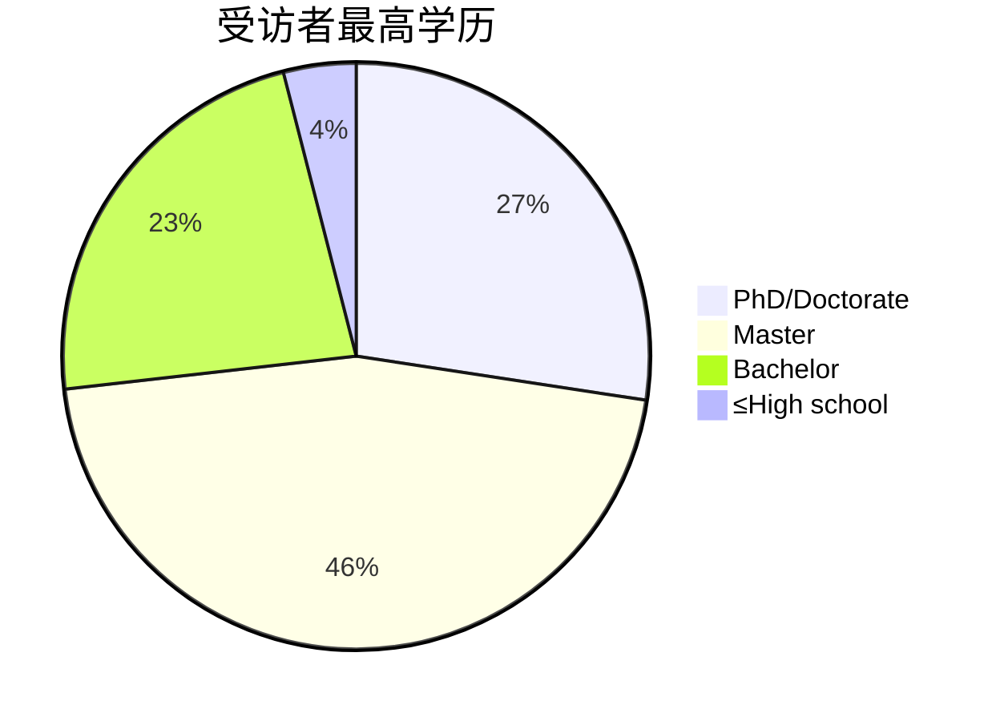
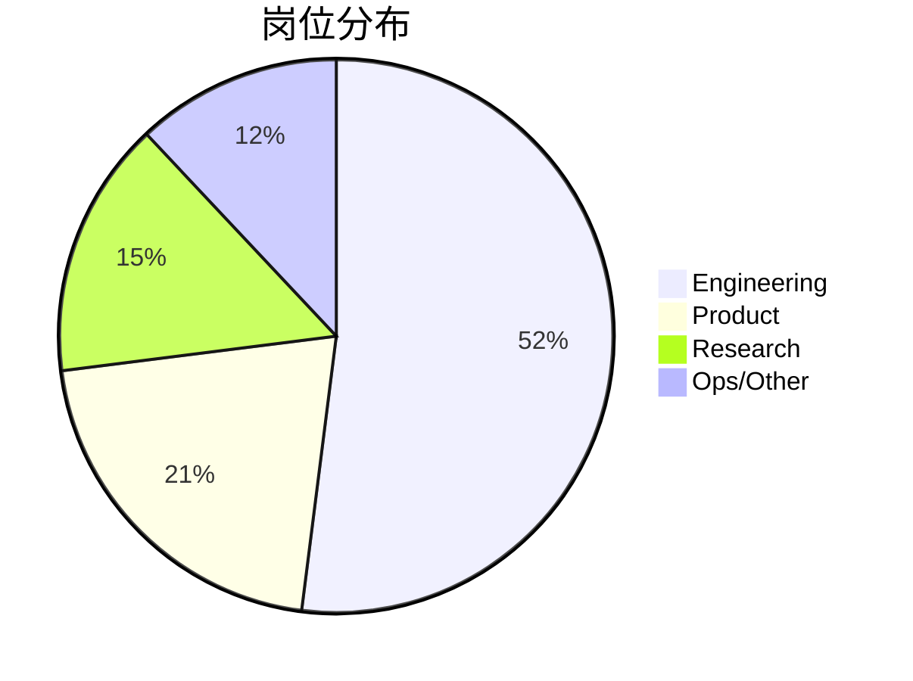

# 第146期《2025年AI现状报告》解读（四）：调研篇

## 📌 前言：1200 位 AI 从业者亲口告诉我们的 10 件事

2025 年 7–9 月，报告团队对 **1 183 位一线从业者**发起匿名问卷——他们来自初创、巨头、高校与政府，覆盖 25 国，**80% 担任技术与产品岗位**。  
这是目前**公开范围最广、教育程度最高、付费比例最大**的生成式 AI 使用调查。我们把它浓缩成 **10 组最硬核的数字 + 10 条最真实的原话**，让你一次看清「谁在用、怎么用、用得多爽、又卡在哪儿」。

---

## 🔢 10 组数字，一眼看懂 2025 年 AI 真实现状

| 话题 | 结果 | 一句话翻译 |
|------|------|------------|
| **渗透率** | 97% 工作场景、94% 生活场景 | “不用 AI 的人”已是 2σ 以外的极少数 |
| **自付比例** | 76% 自掏腰包，>200 美元/月占 9% | 当个人都愿意买单，说明真有用 |
| **生产力** | 92% 认为效率提升，47% “显著” | AI 不是噱头，是提效工具 |
| **搜索替代** | 44% 已用 AI 替换传统搜索 | Google 的首页第一次出现“流量缺口” |
| **工具流失率** | Copilot 净流失 32%，Cursor 净增 46% | 代码场景进入“专用工具”时代 |
| **硬件依赖** | 84% 训练/微调用 NVIDIA GPU | “堆 A100”仍是硬通货 |
| **数据主权** | 仅 13% 因主权问题换供应商 | 口号很响，钱包很诚实 |
| **预算增长** | 73% 组织 AI 预算增加，>25% 占 36% | 经济下行，AI 预算却逆流而上 |
| **最大障碍** | “集成复杂”>“成本”>“隐私” | 2025 年的敌人不是“买不起”，而是“接不上” |
| **监管感知** | 27% 称“完全无影响” | 法规还在 PPT 阶段，远未到落地痛 |

---

## 🗣️ 10 条用户原话，带你看“ wow 瞬间”与“翻车现场”

1. **“我让 Claude Code 重构 8 年代码库，3 天干了我团队 3 个月的活。”**  
2. **“GPT-5 帮我写完博士讨论章，导师以为我请了 ghost writer。”**  
3. **“Midjourney 生成的产品图直接上了亚马逊首图，转化率提高 18%。”**  
4. **“Cursor 自动补全把数据库连接串推到 GitHub，我们被挖矿 5000 美元。”**  
5. **“AI 客服劝用户‘别生气，吃点巧克力’，结果巧克力品牌投诉我们打广告。”**  
6. **“用 AI 做财报分析， hallucination 把亏损写成盈利，股价闪崩 6%。”**  
7. **“DeepSeek-R1 推理链让我看懂自己写的 bug，那一刻比脱单还开心。”**  
8. **“老板现在先问 AI 再问我们，会议室里多出一张‘GPT 椅子’。”**  
9. **“把 AI 当搜索引擎后，我再也不会用关键词了，自然语言真香。”**  
10. **“孩子用 ChatGPT 写作文，老师批注：‘请用 6 年级水平重写。’”**

---

## 📊 三张自制图表，秒懂“谁在用、用什么、用多少钱”

### ① 人群画像：学历 & 角色

---

### ② 工具迁徙流：2025 净增/净失 TOP 5

| 净增工具 | 净增比例 | 净失工具 | 净失比例 |
|----------|----------|----------|----------|
| Cursor | +46% | GitHub Copilot | -32% |
| Claude Code | +37% | Midjourney | -29% |
| Perplexity | +28% | ChatGPT(coding) | -25% |
| Gemini API | +19% | Playground AI | -18% |
| ElevenLabs | +14% | Canva AI | -12% |

> 结论：开发者从“通用助手”迁徙到“场景利器”；**代码→Cursor，搜索→Perplexity，语音→ElevenLabs**。

---

### ③ 预算 vs 障碍热力图

| 预算涨幅 | 受访者% | 最大障碍 | 受访者% |
|----------|---------|----------|---------|
| >+25% | 36 | 集成复杂 | 39 |
| +5~25% | 38 | 成本 | 28 |
| 不变 | 24 | 隐私 | 27 |
| 任何下降 | 3 | 监管 | 19 |

> 一句话：**“有钱没技术栈”是 2025 年 AI 落地的核心矛盾**。

---

## 🧩 四个“没想到”的冷发现

1. **“主权 AI”叫好不叫座**  
   仅 13% 因数据主权更换供应商；**“客户要求”**远多于“自己担心”，地缘政治在 PPT 里比账单里响。

2. **“小模型”时代未到**  
   84% 训练/微调仍用 NVIDIA GPU，**苹果 M 系列仅 17%**，说明“本地小模型”仍是极客玩具。

3. **“AI 第一”公司人效惊人**  
   调研中 **>5M ARR 且 <50 人** 的 AI 公司平均人效 **$2.5M**，是 SaaS 黄金期 3 倍。

4. **“付费意愿”与“生产力感受”强相关**  
   付费 >200 美元/月的群体里，**“显著提效”比例高达 71%**；免费用户仅 18%，**价格滤镜=价值滤镜**。

---

## 🛠️ 开发者专项彩蛋：代码场景 5 大真相

| 问题 | 结果 | 备注 |
|------|------|------|
| 最常用功能 | 代码补全 70% | 调试 54% 第二 |
| 全栈生成使用率 | 33.6% | 环比 +18%（去年仅 15%） |
| “完全不用 AI”比例 | 16.4% → 11% | 一年间再降 5% |
| 最爱语言 | Python 68% | TypeScript 52% 第二 |
| 夜间代码审查机器人 | 38% 团队已部署 | 平均每周节省 4.2 小时 |

---

## 🔭 展望：2026 的 3 个“大概率”

1. **“AI 预算”将首次出现在 80% 企业年报的“核心成本”栏**，而非“创新项目”。
2. **“AI 集成商”会成为新 Tier-1 供应商**，传统 SI 公司若不转型将被收编。
3. **“自然语言接口”将取代 30% 的内部 SaaS 界面**，按钮时代让位于“对话时代”。

